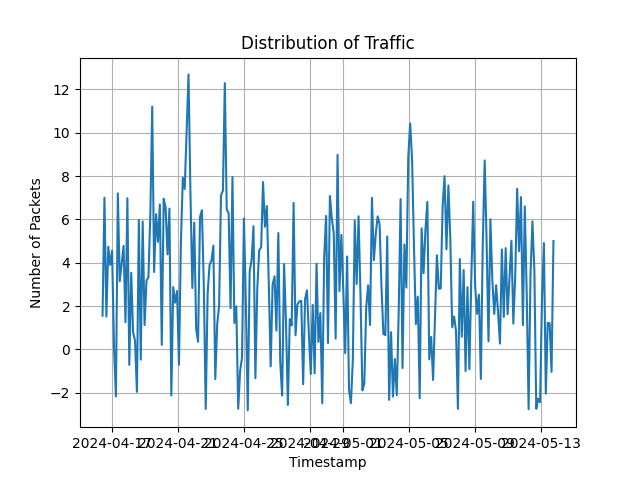
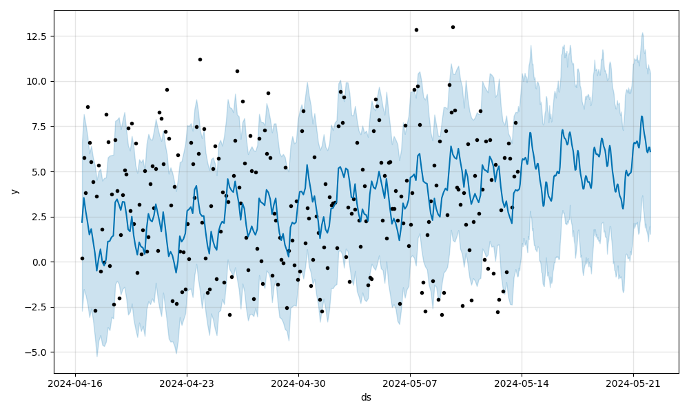
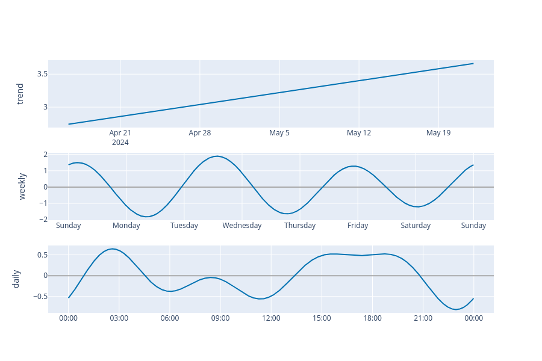

# Traffic Prediction in SDN networks
This project explores the application of machine learning for traffic prediction in Software-Defined Networking (SDN) environments. It leverages the following technologies:

 - __Mininet__: A Python library for emulating network topologies, enabling the creation and experimentation with virtual networks.  
 - __Ryu__: A popular open-source SDN controller framework, providing the foundation for constructing your custom traffic management and data collection logic.  
 - __Prophet__ by Meta: A well-established Facebook (now Meta) open-source library for time series forecasting, ideal for predicting future network traffic patterns.  

### Project Objectives:

Design and implement an SDN network using Mininet, mimicking a real-world or custom topology.  
Develop a Ryu application to:  
- Manage the network communication between hosts and switches.  
- Gather network traffic data for analysis and prediction.  

Utilize Prophet to:  
- Preprocess and format the collected traffic data into a suitable format for machine learning.  
- Train and evaluate a Prophet forecasting model to predict future network traffic patterns.  

### Potential Applications:

Network Capacity Planning: Proactive scaling and resource allocation to accommodate anticipated traffic fluctuations.  
Quality of Service (QoS) Optimization: Prioritization of critical traffic flows based on predicted demands.  
Anomaly Detection: Identification of unusual traffic patterns that may indicate potential security threats or network congestion.  

### Getting Started:

Prerequisites: Ensure you have Python and the required libraries (Mininet, Ryu, Prophet) installed on your system. Refer to their respective documentation for installation instructions.  
The simulation works with specific Ubuntu and python packages versions, so [comnetsemu](https://www.granelli-lab.org/researches/relevant-projects/comnetsemu-labs) virtual machine packages all the requirements in a simple `.ova` file.  

Clone the Repository: Use Git to clone this repository to your local machine (or virtual machine).  

See the sections below for the execution methods.  

## Project Phases

### Creation of the topology

In order to create the topology of the network, [Mininet](http://mininet.org/) was used.  
The file [topology.py](./network/topology.py) contains the topology used for the project.
During development we saw that having more hosts / switches hindered the generation and analysis of the traffic.  
The execution of the file above via `sudo python3 topology.py` sets the environment by creating a remote _Ryu controller_, `controller = RemoteController("c1", "127.0.0.1", 6633)`, running at the port 6633.  
Setting the Network up is then done via the creation of a _Mininet object_:
```python
    net = Mininet(
        topo=Topology(),
        switch=OVSKernelSwitch,
        controller=controller,
        build=False,
        autoSetMacs=True,
        autoStaticArp=True,
        link=TCLink,
    )
```

Where _Topology_ is the class describing a SDN of four hosts and a central switch.  

### Generation of the network traffic

We decided to generate traffic with two different methods in order to test the capabilities of Prophet:  
- Real traffic data via realistic pcap files.  
- Periodic functions determining the interval between each packet sent.  

When executing `sudo python3 topology.py`, the argument `-t / --type` determines the traffic generation method.  

#### Real traffic

The directory [dataset](./dataset/) contains pcap files for each host.  
Each host sends packets to the other 3, and other non-existent hosts to simulate real traffic.   
The following command is executed in the background for each host numbered from i in \[1, 4\]:  
```bash
h${i} for file in dataset/h${i}/*.pcap; do tcpreplay --loop=5000 --loopdelay-ms=5000 -i h${i}-eth0 --pps=10 $file & done
```

This scripts is run inside the Mininet CLI and thanks to `tcpreplay` it replays traffic captured in the pcap files.

#### Periodic functions

Four types of periodic functions generators have been used:  
- sine  
- sawtooth  
- square  
- triangular  
- dsp, combination of the above

The files associated with each of them are wrappers around [traffic.py](./traffic/traffic.py), that has different args to customize the period and duration of the different waves.   

### Packet Acquisition

In order to gain detailed insight into individual host communication, we opted to use tcpdump, a network troubleshooting and packet capture utility. To achieve this, we specified the network interface associated with each host, ensuring we intercepted the relevant network traffic.  

This tool is useful for our purpose because with the flag `-w`, alongside a file name, it generates a pcap file, convenient to be read with software such as wireshark and in this way have a first sight of the traffic.  
  
With the command seen before (`sudo python3 topology.py`), not only the traffic starts to be sent, but also the script [tcpdump_script.sh](./traffic/tcpdump_script.sh) executes tcpdump in the background and, after the simulation completes, four pcap files are saved into the pc, one for each network interface.  

```bash
   #!/bin/bash
     
    HOSTS=4
     
    for ((i = 1; i <= $HOSTS; i++)); do
        echo "starting host_$i"
        sudo tcpdump -i s1-eth${i} -w ./dumps/h${i}_traffic.pcap -U &
    done
     
```
 
Then, we read the content of the pcap files with Wireshark and saved them as CSVs using the option `File > Export Packet Dissections > As CSV`.  
We found using Wireshark useful because it allowed us to have a fast glance at the traffic on the various interfaces, even though we have could used python libraries such as `dpkt` to convert `.pcap` files into `.csv`.   

After this passage, when the csv files have been generated, using Python we filtered for only the first and the second column of the CSVs containing respectively the packet number and the timestamp, so that the files could be parsed by Prophet.    


### Prediction with Prophet

Prophet requires as input one csv file with two columns, ds and y. The first one contains the timestamp and the second one the number of packets associated with that timestamp. The raw traffic data files are converted first into that form and then we applied mainly three strategies (data augmentation, random noise injection and time stretching) to preprocess the data. This is an example of the csv, the floating points derive from the random noise applied to the signal.

```csv
ds,y
2024-04-16 10:29:13,1.5580914740579144
2024-04-16 13:15:53,7.003209013690214
2024-04-16 16:02:33,1.519322426631933
2024-04-16 18:49:13,4.740346761554502
2024-04-16 21:35:53,3.9009595350685204
2024-04-17 00:22:33,4.559584942830919
2024-04-17 03:09:13,0.08581812250609566
2024-04-17 05:55:53,-2.170272678557014
2024-04-17 08:42:33,7.201491744590414
2024-04-17 11:29:13,3.146381910001554
2024-04-17 14:15:53,3.986018809234902
2024-04-17 17:02:33,4.780617939800991
2024-04-17 19:49:13,1.2549430332791238
2024-04-17 22:35:53,6.976312298967413
```

The first demo is from sample waveforms: we generate the traffic following four patterns and we expect prophet to follow them pretty closely. The second one is from a real traffic scenario where we formed a topology consisting of 4 hosts and one switch, we generated traffic, captured it and them fed into prophet to analyze it. Generally a real case traffic scenario it is not particularily interesting to analyze because it has very little frequency content (only day-night and holidays fluctuations).

This is the plot of the sinusoidal signal in input with all the preprocessing strategies applied.



This is the output of prophet, with also a plot of the traffic trends.




